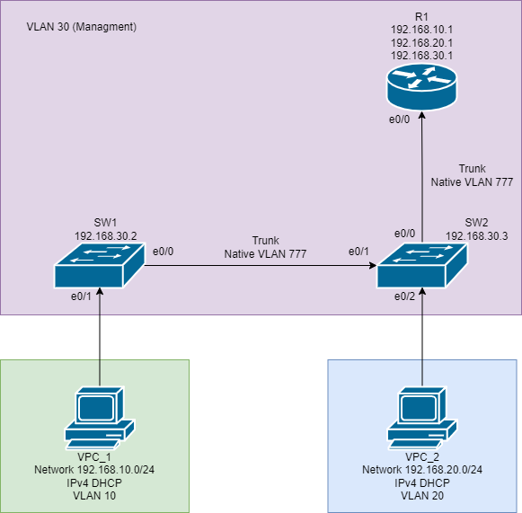
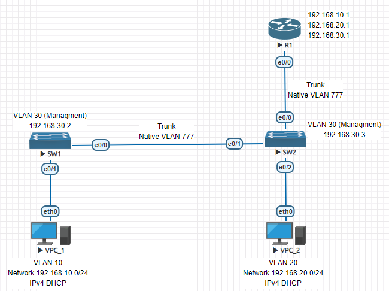
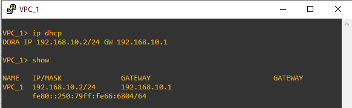
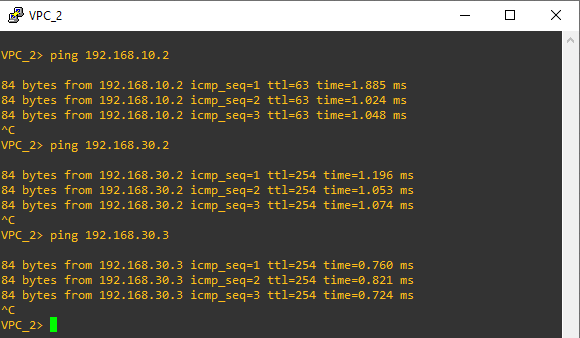

# Настройка маршрутизации между VLAN по схеме Router-on-a-Stick

----

## Задание:

* Построение сети и базовая настройка устройств.
* Создание VLAN и назначение портов коммутаторов.
* Настройка транков между коммутаторами по протоколу 802.1Q
* Настройка маршрутизации между VLAN на маршрутизаторе.
* Проверка работы маршрутизации между VLAN.

### Схема реализации (drawio)



### Схема реализации (EVE-NG)



### Базовая настройка маршрутизатора R1 и коммутаторов SW1 и SW2

----

#### Базовая настройка маршрутизатора R1
```
version 15.4
service timestamps debug datetime msec
service timestamps log datetime msec
service password-encryption
!
hostname R1
!
boot-start-marker
boot-end-marker
!
enable secret 8 $8$iKzHDehBNyJK5q$.4jtPlWvjmPzC8AkiHrywTVeGNoqSbN9CN/dAmW7gYw
!
no aaa new-model
clock timezone MSK 3 0
mmi polling-interval 60
no mmi auto-configure
no mmi pvc
mmi snmp-timeout 180
!
no ip domain lookup
ip cef
no ipv6 cef
!
banner login ^C
$$$$$$$$$$$$$$$$$$$$$$$$$$$$$$$$$$$$$$$$$$$$$$$$$$$$$$$$$$$$$
$$          All activity is subject to monitoring.         $$
$$      Any UNAUTHORIZED access or use is PROHIBITED,      $$
$$              and may result in PROSECUTION.             $$
$$                      << R1 >>                           $$
$$$$$$$$$$$$$$$$$$$$$$$$$$$$$$$$$$$$$$$$$$$$$$$$$$$$$$$$$$$$$

^C
!
line con 0
 password 7 070C285F4D06
 logging synchronous
line aux 0
line vty 0 4
 password 7 045802150C2E
 login
 transport input none
```

#### Базовая настройка коммутатора SW1

```
version 15.2
service timestamps debug datetime msec
service timestamps log datetime msec
service password-encryption
service compress-config
!
hostname SW1
!
boot-start-marker
boot-end-marker
!
enable secret 8 $8$qHIx.zuDOKotHn$ZDHChDj7iL.WxILTp2u0WLy0vlyDq01ALQRoX.irNiE
enable password 7 1511021F0725
!
no aaa new-model
clock timezone MSK 3 0
!
ip dhcp snooping vlan 10
no ip domain-lookup
ip cef
no ipv6 cef
!
banner login ^C
$$$$$$$$$$$$$$$$$$$$$$$$$$$$$$$$$$$$$$$$$$$$$$$$$$$$$$$$$$$$$
$$          All activity is subject to monitoring.         $$
$$      Any UNAUTHORIZED access or use is PROHIBITED,      $$
$$              and may result in PROSECUTION.             $$
$$                      << SW1 >>                          $$
$$$$$$$$$$$$$$$$$$$$$$$$$$$$$$$$$$$$$$$$$$$$$$$$$$$$$$$$$$$$$

!
line con 0
 password 7 070C285F4D06
 logging synchronous
line aux 0
line vty 0 4
 password 7 02050D480809
 login
```

#### Базовая настройка коммутатора SW2

```
version 15.2
service timestamps debug datetime msec
service timestamps log datetime msec
service password-encryption
service compress-config
!
hostname SW2
!
boot-start-marker
boot-end-marker
!
enable secret 8 $8$aux2ioJaRrlxP1$Fay9PzBQ0jz3x7bZ/86fX8FPRni1783dVcIA544fbIs
enable password 7 094F471A1A0A
!
no aaa new-model
clock timezone MSK 3 0
!
ip dhcp snooping vlan 20
no ip domain-lookup
ip cef
no ipv6 cef
!
banner login ^C
$$$$$$$$$$$$$$$$$$$$$$$$$$$$$$$$$$$$$$$$$$$$$$$$$$$$$$$$$$$$$
$$          All activity is subject to monitoring.         $$
$$      Any UNAUTHORIZED access or use is PROHIBITED,      $$
$$              and may result in PROSECUTION.             $$
$$                      << SW2 >>                          $$
$$$$$$$$$$$$$$$$$$$$$$$$$$$$$$$$$$$$$$$$$$$$$$$$$$$$$$$$$$$$$

^C
!
line con 0
 password 7 13061E010803
 logging synchronous
line aux 0
line vty 0 4
 password 7 0822455D0A16
 login
```

### Настройка интерфейсов и VLAN на маршрутизаторе R1 и коммутаторах SW1 и SW2

----

Таблица распределения адресного пространства

| Device | Interface | IP Address   | Subnet Mask   | Default Gateway |
| ------ | --------- | ------------ | ------------- | --------------- |
| R1     | e0/0.10   | 192.168.10.1 | 255.255.255.0 | \-              |
| \-     | e0/0.20   | 192.168.20.1 | 255.255.255.0 | \-              |
| \-     | e0/0.30   | 192.168.30.1 | 255.255.255.0 | \-              |
| \-     | e0/0.777  | \-           | \-            | \-              |
| SW1    | VLAN 30   | 192.168.30.2 | 255.255.255.0 | 192.168.30.1    |
| SW2    | VLAN 30   | 192.168.30.3 | 255.255.255.0 | 192.168.30.1    |
| VPC_1  | NIC       | IPv4 DHCP    | IPv4 DHCP     | 192.168.10.1    |
| VPC_2  | NIC       | IPv4 DHCP    | IPv4 DHCP     | 192.168.20.1    |

Таблица VLAN

| VLAN-ID | Name       | Interfaces                              | Description                                |
| ------- | ---------- | --------------------------------------- | ------------------------------------------ |
| 10      | Clients    | VPC_1, R1: e0/0.10                      | VLAN для конечных пользователей (VPC_1)    |
| 20      | Clients    | VPC_2, R1: e0/0.20                      | VLAN для конечных пользователей (VPC_2)    |
| 30      | Management | R1: e0/0.30, SW1: VLAN 30, SW2: VLAN 30 | Управление маршрутизатором и коммутаторами |
| 777     | Native     | \-                                      | Нетегированный трафик 802.1Q               |


#### Настройка интерфейсов маршрутизатора R1 и DHCP-пулов для клиентов

```
ip dhcp excluded-address 192.168.10.1
ip dhcp excluded-address 192.168.20.1
!
ip dhcp pool Net_For_Client_VLAN_10
 network 192.168.10.0 255.255.255.0
 default-router 192.168.10.1
!
ip dhcp pool Net_For_Client_VLAN_20
 network 192.168.20.0 255.255.255.0
 default-router 192.168.20.1
!
interface Ethernet0/0
 no ip address
!
interface Ethernet0/0.10
 description Net_For_Client_VLAN_10
 encapsulation dot1Q 10
 ip address 192.168.10.1 255.255.255.0
!
interface Ethernet0/0.20
 description Net_For_Client_VLAN_20
 encapsulation dot1Q 20
 ip address 192.168.20.1 255.255.255.0
!
interface Ethernet0/0.30
 description MANAGMENT
 encapsulation dot1Q 30
 ip address 192.168.30.1 255.255.255.0
!
interface Ethernet0/0.777
 encapsulation dot1Q 777 native
!
```

#### Настройка интерфейсов на коммутаторе SW1

```
interface Ethernet0/0
 description sw1-to-sw2
 switchport trunk allowed vlan 10,30
 switchport trunk encapsulation dot1q
 switchport trunk native vlan 777
 switchport mode trunk
 ip dhcp snooping trust
!
interface Ethernet0/1
 description to-vpc_1
 switchport access vlan 10
 switchport mode access
 spanning-tree portfast
!
interface Vlan30
 ip address 192.168.30.2 255.255.255.0
!
ip route 0.0.0.0 0.0.0.0 192.168.30.1

```

#### Настройка интерфейсов на коммутаторе SW2

```
interface Ethernet0/0
 description sw2-to-r1
 switchport trunk allowed vlan 10,20,30
 switchport trunk encapsulation dot1q
 switchport trunk native vlan 777
 switchport mode trunk
 ip dhcp snooping trust
!
interface Ethernet0/1
 description sw2-to-sw1
 switchport trunk allowed vlan 10,30
 switchport trunk encapsulation dot1q
 switchport trunk native vlan 777
 switchport mode trunk
!
interface Ethernet0/2
 description to-vpc_2
 switchport access vlan 20
 switchport mode access
 spanning-tree portfast
!
interface Vlan30
 ip address 192.168.30.3 255.255.255.0
!
ip route 0.0.0.0 0.0.0.0 192.168.30.1
```

### Проверка работоспособности схемы

----

#### VPC_1 - получение настроек сетевого интерфеса по DHCP



#### VPC_2 - получение настроек сетевого интерфеса по DHCP


#### Проверка доступности сетей 192.168.20.0/24, 192.168.30.0/24 с VPC_1 (192.168.10.0/24)


#### Проверка доступности сетей 192.168.10.0/24, 192.168.30.0/24 с VPC_2 (192.168.20.0/24)



